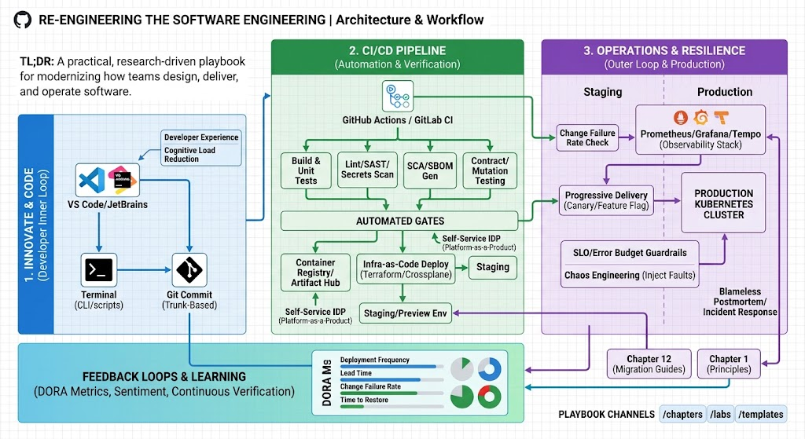

# re-engineering-the-software-engineering

Re-engineering the Software Engineering — a practical, research-driven playbook for modernizing how teams design, deliver, and operate software: automation, observability, platform thinking, and human-centered practices.

[](#)
[](./LICENSE)
[](#contributors)
[](./issues)



## TL;DR
A living, opinionated toolkit and playbook of patterns, reproducible examples, migration guides, and measurement templates to increase velocity, reliability, and developer experience across CI/CD, observability, platform engineering, and data-driven quality.

---

## Table of Contents
- [About](#about)
- [Quick Start](#quick-start)
- [Chapters](#chapters)
- [How to Use This Playbook](#how-to-use-this-playbook)
- [Examples & Runnable Labs](#examples--runnable-labs)
- [Repository Structure](#repository-structure)
- [Contribution Guide](#contribution-guide)
- [Roadmap](#roadmap)
- [Code of Conduct](#code-of-conduct)
- [License](#license)
- [Contact & Support](#contact--support)

---

## About
This repository collects pragmatic guidance, design patterns, migration recipes, and reproducible proof-of-concepts to help engineering leaders, platform teams, SREs, QA, and practitioners modernize software delivery. It blends research, case studies, and hands-on experiments with concrete artifacts you can adapt and run in your organization.

---

## Quick Start
1. **Clone the repository:**
   ```bash
   git clone [https://github.com/bundlab/re-engineering-the-software-engineering.git](https://github.com/bundlab/re-engineering-the-software-engineering.git)
   cd re-engineering-the-software-engineering
   ```
2. **Browse the chapters:**
   Explore files inside [`/chapters`](https://www.google.com/search?q=./chapters/) for guided content and implementation blueprints.
3. **Run the lab examples:**
   Check [`/labs`](https://www.google.com/search?q=./labs/) for runnable local demos using Docker, Devcontainers, and IaC manifests.
4. **Contribute:**
   Submit patterns, fixes, or experiments via pull requests following our [Contribution Guide](https://www.google.com/search?q=./CONTRIBUTING.md).

---

## Chapters

| # | Chapter File | Description |
| --- | --- | --- |
| **01** | [`01-introduction.md`](https://www.google.com/search?q=./chapters/01-introduction.md) | Orientation, scope, audience, guiding principles, and methodology. |
| **02** | [`02-diagnostics-and-metrics.md`](https://www.google.com/search?q=./chapters/02-diagnostics-and-metrics.md) | Measurement strategy, DORA metrics, SLO design, and error budgets. |
| **03** | [`03-automation-first-ci-cd.md`](https://www.google.com/search?q=./chapters/03-automation-first-ci-cd.md) | Pipeline patterns, pipeline-as-code, feature flags, and deployment strategies. |
| **04** | [`04-infra-as-code.md`](https://www.google.com/search?q=./chapters/04-infra-as-code.md) | IaC design, state management, drift detection, and automated enforcement. |
| **05** | [`05-observability-and-verification.md`](https://www.google.com/search?q=./chapters/05-observability-and-verification.md) | Logs, metrics, traces, context propagation, and continuous verification. |
| **06** | [`06-platform-engineering.md`](https://www.google.com/search?q=./chapters/06-platform-engineering.md) | Internal developer platforms (IDP), self-service portals, and Platform-as-a-Product. |
| **07** | [`07-quality-and-testing.md`](https://www.google.com/search?q=./chapters/07-quality-and-testing.md) | Shift-left testing, contract testing, mutation testing, and test data management. |
| **08** | [`08-security-in-the-pipeline.md`](https://www.google.com/search?q=./chapters/08-security-in-the-pipeline.md) | DevSecOps, SAST/DAST, SBOMs, supply-chain security, and Policy-as-Code. |
| **09** | [`09-resilience-and-chaos.md`](https://www.google.com/search?q=./chapters/09-resilience-and-chaos.md) | Fault tolerance, chaos engineering, game days, and progressive delivery. |
| **10** | [`10-operations-and-oncall.md`](https://www.google.com/search?q=./chapters/10-operations-and-oncall.md) | SRE practices, incident management, on-call hygiene, and automated runbooks. |
| **11** | [`11-developer-experience.md`](https://www.google.com/search?q=./chapters/11-developer-experience.md) | DevEx metrics, local environments, cognitive load reduction, and inner loop. |
| **12** | [`12-migration-and-adoption-guides.md`](https://www.google.com/search?q=./chapters/12-migration-and-adoption-guides.md) | Legacy modernization, Strangler Fig pattern, and organizational change management. |
| **13** | [`13-measurement-and-feedback.md`](https://www.google.com/search?q=./chapters/13-measurement-and-feedback.md) | Feedback loops, data-driven postmortems, sentiment tracking, and learning loops. |
| **14** | [`14-governance-and-policy.md`](https://www.google.com/search?q=./chapters/14-governance-and-policy.md) | Multi-tenant governance, FinOps, cloud cost management, and regulatory compliance. |
| **15** | [`15-case-studies-and-experiments.md`](https://www.google.com/search?q=./chapters/15-case-studies-and-experiments.md) | Production case studies, benchmark metrics, reproducible experiments, and results. |

---

## How to Use This Playbook

Each chapter follows a structured format:

* **Problem Statement** — Context and business/technical impact.
* **Principles & Decision Criteria** — Core guardrails and trade-offs.
* **Patterns & Anti-Patterns** — Field-tested practices vs. common pitfalls.
* **Implementation Recipes** — Minimal, recommended, and advanced setups.
* **Checklists & Migration Steps** — Actionable steps for execution.
* **Reproducible Examples** — Links to executable code in `/labs`.
* **Measurement & Success Criteria** — KPIs to prove success.

---

## Examples & Runnable Labs

Labs are reproducible environments built with Terraform, Docker, Kubernetes, and GitHub Actions:

* **`lab-ci-cd-playground/`** — Trunk-based release automation with automated canary verification.
* **`lab-observability/`** — OpenTelemetry collector + Prometheus + Grafana + Loki + Tempo stack.
* **`lab-platform-quickstart/`** — Self-service developer portal template with scaffolded service templates.

---

## Repository Structure

```text
.
├── chapters/
│   ├── 01-introduction.md
│   ├── 02-diagnostics-and-metrics.md
│   ├── ...
│   └── 15-case-studies-and-experiments.md
├── labs/
│   ├── lab-ci-cd-playground/
│   ├── lab-observability/
│   └── lab-platform-quickstart/
├── templates/
│   ├── Incident-playbook-template.md
│   ├── Migration-plan-template.md
│   └── SLO-template.yaml
├── assets/
│   └── hero.png
├── .github/
│   └── ISSUE_TEMPLATE/
├── CODE_OF_CONDUCT.md
├── CONTRIBUTING.md
├── LICENSE
├── README.md
└── ROADMAP.md

```

---

## Contribution Guide

We welcome contributions! Please review [`CONTRIBUTING.md`](https://www.google.com/search?q=./CONTRIBUTING.md) before opening a PR.

Key guidelines:

* Keep PRs focused with clear problem statements and patterns.
* Provide runnable test steps or manifests for lab contributions.
* Tag pull requests appropriately (`enhancement`, `doc`, `lab`, `experiment`).

---

## Roadmap

See [`ROADMAP.md`](https://www.google.com/search?q=./ROADMAP.md) for details on current priorities:

* Expand platform engineering lab templates.
* Add real-world FinOps and cost-optimization case studies.
* Enhance continuous verification modules.

---

## License & Code of Conduct

* **Code of Conduct:** [`CODE_OF_CONDUCT.md`](https://www.google.com/search?q=./CODE_OF_CONDUCT.md)
* **License:** Open source under the [MIT License](https://www.google.com/search?q=./LICENSE).

---

## Contact & Support

* **Issues:** Report bugs or request features on [GitHub Issues](https://www.google.com/search?q=../../issues).
* **Discussions:** Ask questions and share feedback on [GitHub Discussions](https://www.google.com/search?q=../../discussions).


